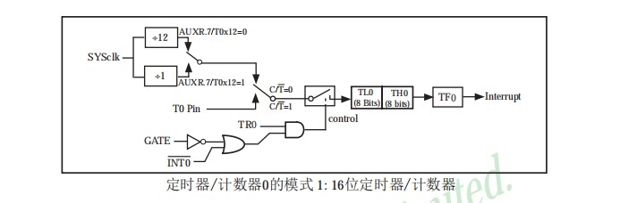
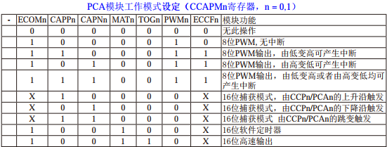

# 使用STC12制作频率计

## 1. 1602液晶配置
- ### LCD Init	
	初始命令
- ### Display 显示
	通过writedata写入


## 2. 关于定时器
- ### TMOD-定时器工作模式
|7		|6	|5	|4	|3		|2	|1	|0	|
|--		|--	|--	|--	|--		|--	|--	|--	|
|GATE	|C/T|M1	|M0	|GATE	|C/T|M1	|M0	|    

 ***GATE*** : 1-仅在INT0脚为高及TR0控制位置1时才可以打开定时器  
 ***C/T*** : 0-用作定时器（内部时钟）；1-用作计数器（T1或P3^5引入）  
 ***M1 M0*** : 00-13位（TL1仅低五位）；01-16位；10-8位自动重装；11-停止计数  
  
- ### TCON-定时器控制寄存器
|7	|6	|5	|4	|3	|2	|1	|0	|
|--	|--	|--	|--	|--	|--	|--	|--	|
|TF1|TR1|TF0|TR0|IE1|IT1|IE0|IT0|

 ***TF*** : TimerFull 定时器/计时器溢出标志  
 ***TR*** : TimerRun 定时器运行控制位 与GATE联动  
 ***IE*** : InterruptEnable 外部中断向CPU请求中断，CPU响应后清0  
 ***IT*** : InterruptTrigger 外部中断触发方式 0--INT(P3^3)输入为低电平触发 
 
- ### AUXR-辅助寄存器
|7		|6		|5			|4		|3		|2		|1		|0		|
|--		|--		|--			|--		|--		|--		|--		|--		|
|TOx12	|TIx12	|UART_MOx6	|BRTR	|S2SMOD	| BKTx12|EXTRAM	|SIBRS	|

 ***T0x12*** : 定时器速度控制位 0--12分频 1--不分频	
 ``` c
	sfr AUXR = 0x8e
```

 
## 3.  定时器配置
采用32.768MHz的晶振，因此使用模式1,16位定时器，计数器使用1T模式。



*定时器计算：*  
1ms: 65536 - FOSC/分频/1000;  
16位定时器即: 2^16 = 65536;
OSFC:OScillateFrequenCy  晶振频率 32768000;  
(对于此项：1ms = 1000 0000 0000 0000)	
得到1ms后用软件循环获得相应的时间
``` c
	#define OSFC 32768000
	#define T1MS (65536 - OSFC/100)
	void timer0_init(){
		AUXR = 0x80; //time0 work in 1T mode
		TMOD = 0x01; //01 mode1 16bit
	    TL0 = T1MS;  //initial timer0
	    TH0 = T1MS >> 8;
	    TR0 = 1;	//timer0 run
	    ET0 = 1;	//enable timer0
	    EA = 1;		//open global interrupt switch
	}
```

## 4.PCA基础
PCA : Programmable Counter Array
工作模式：上升沿/下降沿脉冲捕获，软件定时器、高速输出、PWM可调制脉冲输出
- ### CMOD PCA工作模式寄存器
|7		|6	|5	|4	|3		|2		|1		|0	|
|--		|--	|--	|--	|--		|--		|--		|--	|
|CIDL	|-	|-	|-	|CPS2	|CPS1	|CPS0	|ECF|
	
 ***CIDL*** : 空闲模式下是否停止PCA计数的控制位 0-继续	
 ***CPS*** : 000-SYSclk/12;001-SYSclk/2;101-SYSclk/4;110-SYSclk/6;111-SYSclk/8；	
			 010-timer0的溢出脉冲，timer0工作在1T模式下，一个时钟即可溢出，那么timer0的溢出频率=SYSclk，改变timer0的溢出频率可以实现可调频率的PWM输出；	
			 011-ECI/P1.2(P4.1)脚输入的外部时钟，最大速率为SYSclk/2	
 ***ECF*** : 溢出中断使能，0-禁止CF中断	

- ### CCON 控制寄存器
|7	|6	|5	|4	|3	|2	|1		|0		|
|--	|--	|--	|--	|--	|--	|--		|--		|
|CF	|CR	|-	|-	|-	|-	|CCF1	|CCF0	|

 ***CF*** : Full溢出标志	
 ***CR*** : Run	
 ***CCFx*** : PCAx中断标志	
	
- ### CCAPMx 比较compare/捕获acquire寄存器
|7	|6		|5		|4		|3		|2		|1		|0		|
|--	|--		|--		|--		|--		|--		|--		|--		|
|-	|ECOM0	|CAPP0	|CAPN0	|MAT0	|TOG0	|PWM0	|ECCF0	|

 ***ECOM*** : Compare 1-允许比较器功能	
 ***CAPP*** : Capture Positive 1-允许上升沿捕获	
 ***CAPN*** : Capture Negative 1-允许下降沿捕获	
 ***MAT*** : Match 1-PCA计数值与该寄存器的值匹配将置位CCON寄存器的中断标志位CCF0	
 ***TOG*** : TurnOver 1-工作在PCA高速输出模式	
 ***PWM*** : 1-允许CEXx用作脉宽调节输出	
 ***ECCF*** : 使能寄存器CCON的比较/捕获标志，用于产生中断	
 
 
- ### 保存值
 ***CL/CH*** : 装载寄存器。保存PCA装载值	
 ***CCAPxL/CCAPxH*** : 捕获寄存器。PCA用于捕获和比较时，保存x模块16位的捕捉计数值；用于PWM时，用来控制输出占空比
 
- ### PCA_PWM
 该项目暂不涉及
 
- ### 从P1口设置到P4口

## 5.外部脉冲捕捉

 - ### CAPP(positive)/CAPN(negative)上升沿下降沿捕获之一置1
 工作于捕获模式时，对外部CCPx输入跳变进行采样(CCP0/P1.3,CCP1/P1.4)，采样到有效跳变时，硬件将CH/CL的值装载到捕获寄存器中
 